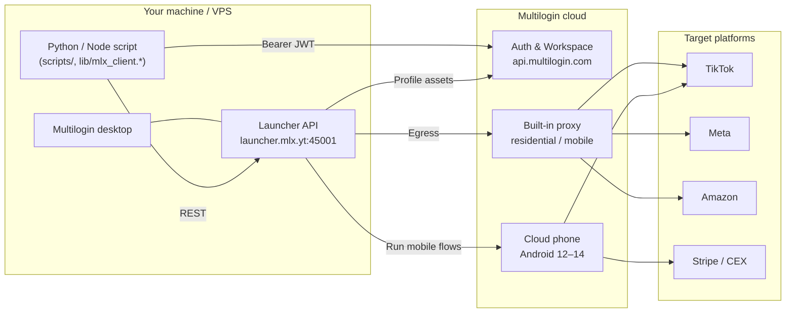
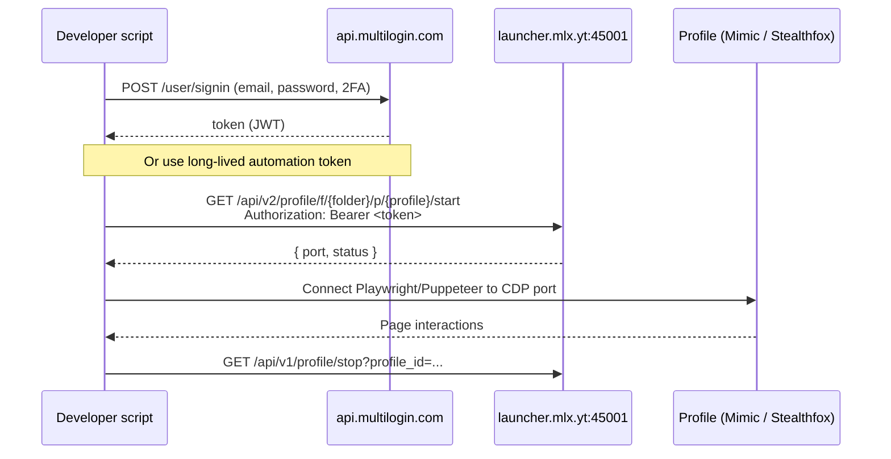
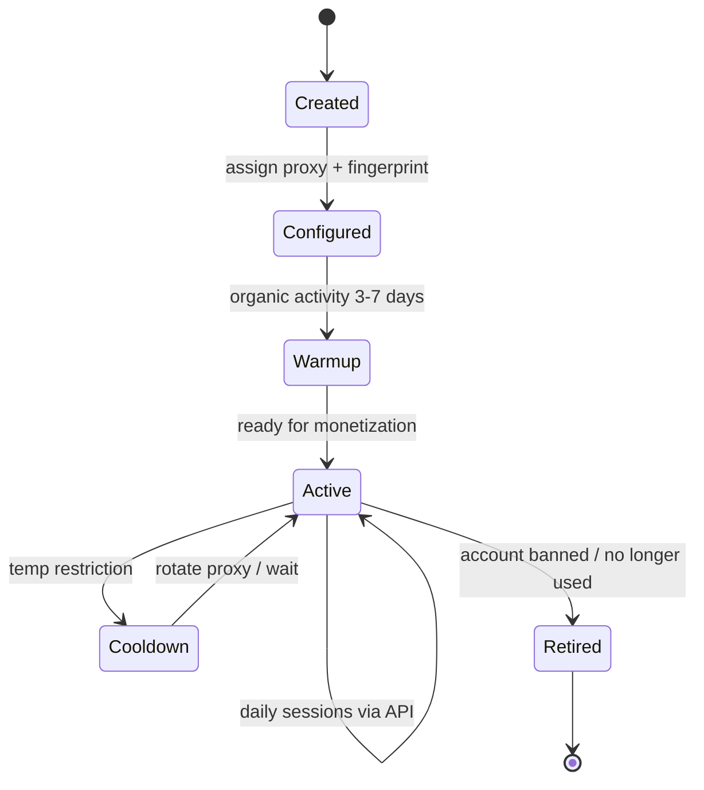
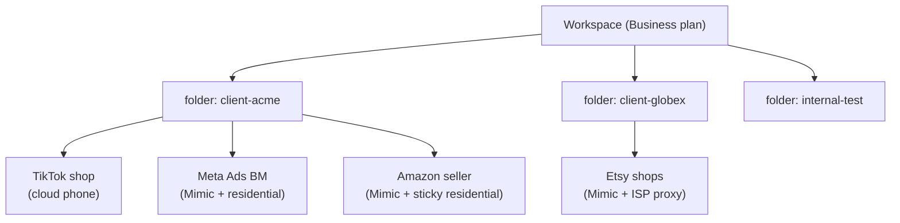
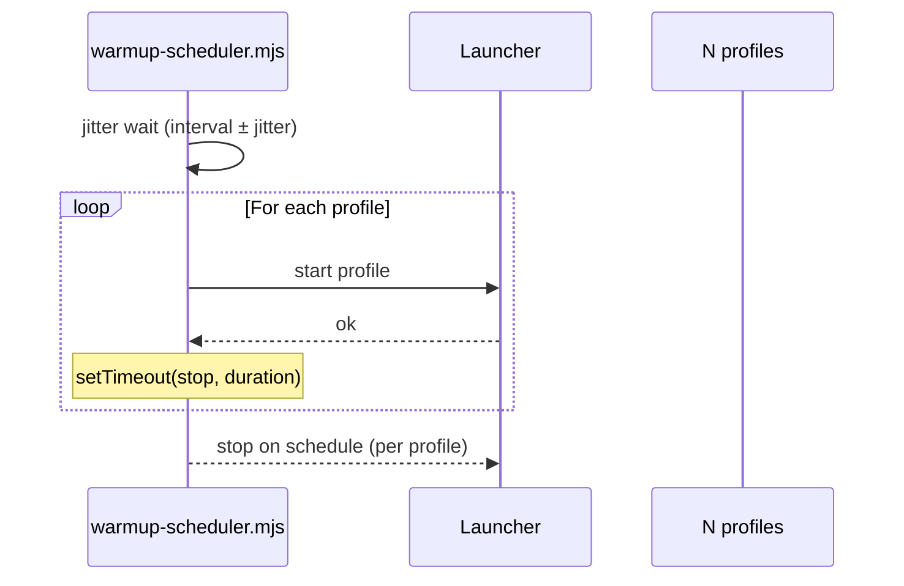

# Architecture — Multilogin Labs stack

> [Partner pricing →](https://multilogin.com/pricing/?utm_source=saas&utm_medium=partner&a_aid=saas&a_bid=f5fad549) · Codes **SAAS50** · **MIN50**

How a typical multi-account operation is wired with Multilogin.

## High-level

## Authentication flow

## Profile lifecycle

## Recommended folder structure for agencies

## Data flow for warmup scheduler

## See also

- [API CHEATSHEET](api/CHEATSHEET.md) · [Quick start](api/quick-start.md) · [Swagger UI](api/swagger.html)
- [Cookbook ×40](api/cookbook/README.md) · [Comparison matrix](comparisons/comparison-matrix.md)
